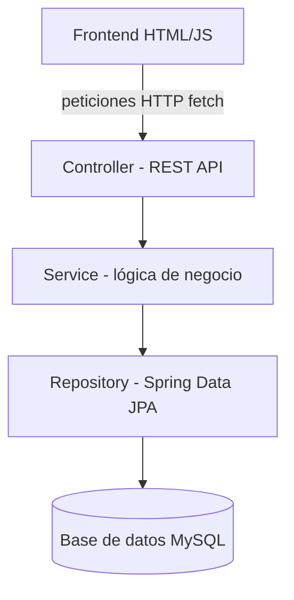
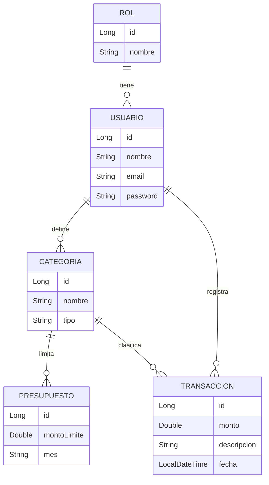

# Dashboard de Finanzas Personales

sistema web para registrar ingresos y gastos,
con presupuestos por categoría y alertas cuando se excede el límite mensual.
Múltiples usuarios con autenticación JWT.

## Arquitectura

Arquitectura en capas:



## Modelo de datos



- **Usuario** — pertenece a un **Rol**
- **Categoría** — de tipo INGRESO o GASTO, pertenece a un usuario (cada quien define las suyas)
- **Presupuesto** — límite mensual (`mes` en formato "2026-09") para una categoría de tipo GASTO
- **Transacción** — cada movimiento de dinero: monto, categoría, fecha, descripción

## La regla de negocio

En `TransaccionService.registrarTransaccion()`:

1. Se guarda la transacción (a diferencia del inventario, **nunca se bloquea** — el
   dinero ya se gastó en la vida real, el sistema solo puede informar)
2. Si la categoría es GASTO, se suma todo lo gastado en esa categoría durante
   el mes de la transacción
3. Se compara ese total contra el `Presupuesto` definido para esa categoría/mes
   (si existe)
4. El resultado (`TransaccionResultado`) incluye el porcentaje usado y si se
   excedió el límite — el frontend usa esto para mostrar una alerta visual

## Seguridad

- **BCrypt** para encriptar contraseñas (`UsuarioService`)
- **JWT** para autenticación stateless (`JwtUtil` + `JwtAuthFilter`)
- Rutas públicas: `POST /api/usuarios/login` y `POST /api/usuarios/registro`;
  todo lo demás requiere token válido en el header `Authorization: Bearer <token>`

## Estructura de carpetas

```
finanzas-app/
├── backend/
│   ├── pom.xml
│   └── src/
│       ├── main/java/com/finanzas/
│       │   ├── model/         → Usuario, Rol, Categoria, Presupuesto, Transaccion, TipoCategoria
│       │   ├── repository/    → interfaces JpaRepository
│       │   ├── service/       → logica de negocio (presupuesto, balance)
│       │   ├── controller/    → endpoints REST
│       │   ├── config/        → seguridad (BCrypt, JWT) y manejo de errores
│       │   └── Application.java
│       └── test/java/com/finanzas/service/
│           └── TransaccionServiceTest.java  → 4 casos con Mockito
├── frontend/
│   ├── index.html      → login
│   ├── dashboard.html  → registro de transacciones + alerta de presupuesto
│   └── js/api.js
└── database/
    └── schema.sql
```

## Cómo correrlo

1. Crea la base de datos: `CREATE DATABASE finanzas_db;`
2. Edita `backend/src/main/resources/application.properties` con tu usuario/password de MySQL
3. Desde `backend/`: `mvn spring-boot:run` — levanta en `http://localhost:8081`
   (puerto distinto al de inventario, por si quieres correr ambos proyectos a la vez)
4. Registra un usuario con `POST /api/usuarios/registro` (no lo pongas directo en
   la base de datos: así el password queda encriptado con BCrypt automáticamente)
5. Abre `frontend/index.html` en el navegador

## Endpoints principales

| Método | Ruta                                          | Qué hace                                  |
|--------|-----------------------------------------------|---------------------------------------------|
| POST   | /api/usuarios/registro                        | Crea usuario (password encriptado)          |
| POST   | /api/usuarios/login                            | Login, devuelve token JWT                    |
| GET    | /api/categorias/usuario/{id}                  | Categorías del usuario                       |
| POST   | /api/categorias                                | Crea categoría                                |
| POST   | /api/presupuestos                              | Crea presupuesto mensual                     |
| GET    | /api/presupuestos/usuario/{id}?mes=2026-09    | Presupuestos de un mes                       |
| POST   | /api/transacciones                             | Registra transacción (devuelve alerta si aplica) |
| GET    | /api/transacciones/usuario/{id}               | Historial del usuario                        |
| GET    | /api/transacciones/usuario/{id}/balance       | Balance (ingresos - gastos) en un rango de fechas |

## Tests

`mvn test` desde `backend/`. Cubre: gasto dentro del presupuesto, gasto que lo
excede, gasto sin presupuesto definido (no debe fallar), e ingresos (que nunca
deben consultar presupuestos).

